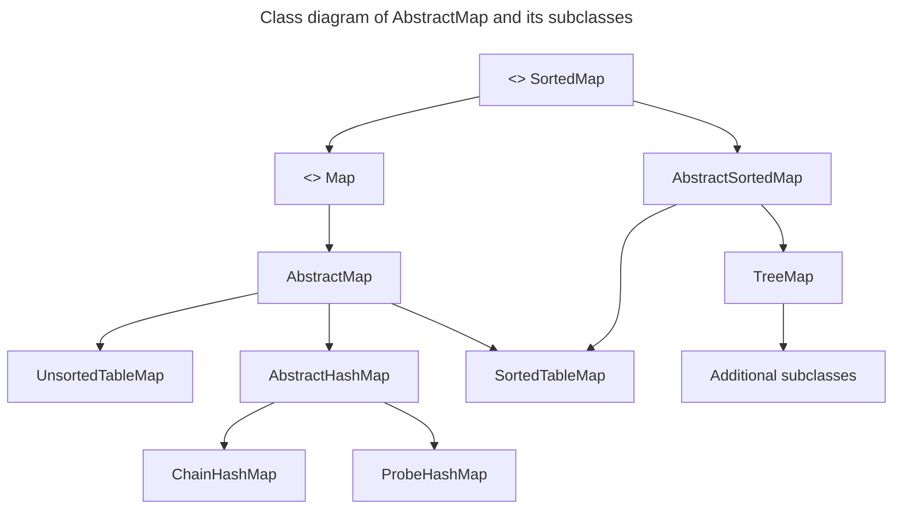
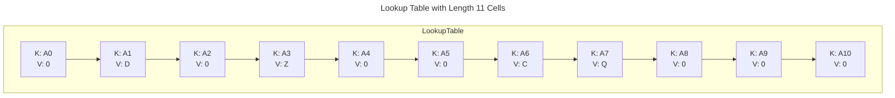
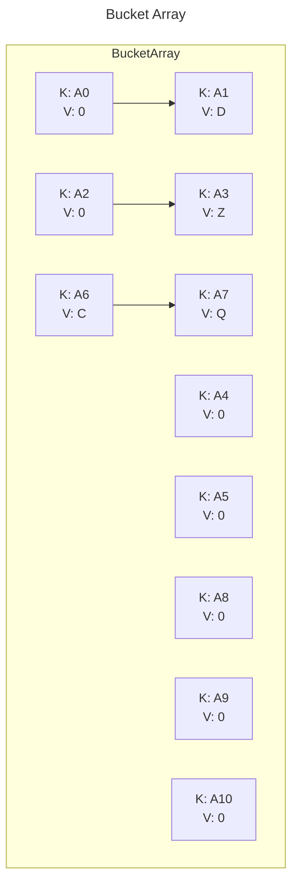
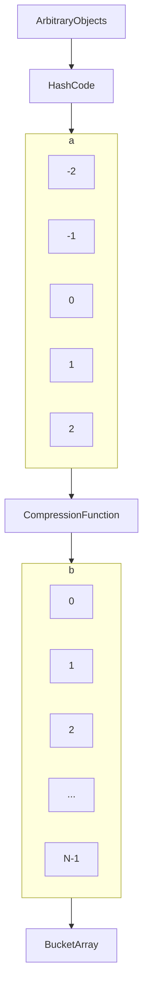
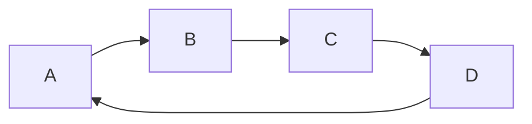
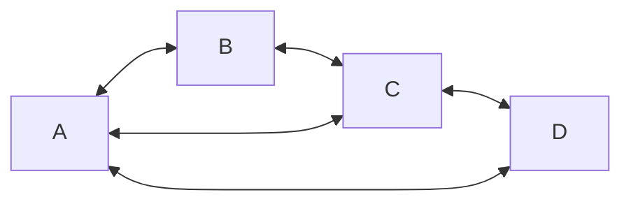
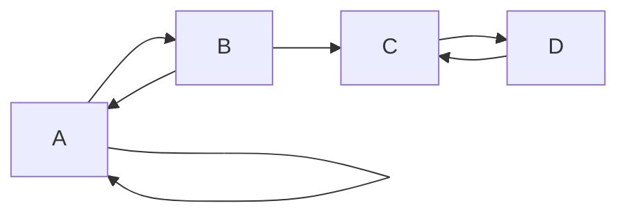
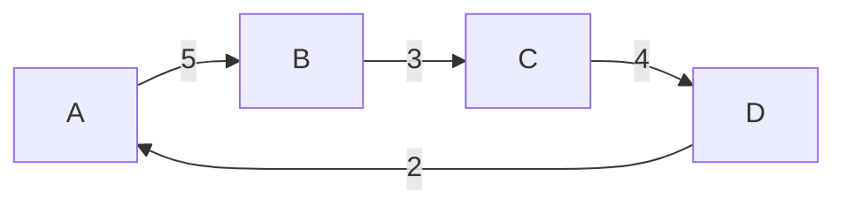

# Dati e Algoritmi

## Mappe
Una mappa è un ADT pensato per immagazzinare e ripescare valori unicamente tramite una **chiave di ricerca** associata a ciascun valore. Più in specifico, una mappa è una collezione di coppie chiave-valore, dove ogni chiave è associata ad un solo valore. Le operazioni principali che si possono effettuare su una mappa sono:
- `put(key, value)`: inserisce una nuova coppia chiave-valore nella mappa, o sovrascrive il valore associato ad una chiave già presente.
- `get(key)`: restituisce il valore associato alla chiave specificata.
- `remove(key)`: rimuove la coppia chiave-valore associata alla chiave specificata.
- `containsKey(key)`: restituisce `True` se la chiave specificata è presente nella mappa, `False` altrimenti.
- `size()`: restituisce il numero di coppie chiave-valore presenti nella mappa.
- `isEmpty()`: restituisce `True` se la mappa è vuota, `False` altrimenti.
- `values()`: restituisce una lista contenente tutti i valori presenti nella mappa.
- `entrySet()`: restituisce una collezione iterabile contenente tutte le coppie chiave-valore presenti nella mappa.

Le mappe sono note anche come array associativi, perché permettono di associare ad ogni chiave un valore. In Python, le mappe sono implementate tramite i dizionari, mentre in Java sono rappresentate dall'interfaccia `Map`. Però, in confronto ad un array tradizionale, una chiave di una mappa non dev'essere necessariamente numerico, e non deve per forza associare una posizione dentro la struttura. 

Delle applicazioni comuni delle mappe sono:
- Student ID (Key) -> Student Object (Value)
- Mappe DNS (Domain Name -> IP Address)
- Social Media (Username -> User Profile)
- Database aziendale di clienti (Customer ID -> Customer Object)
- Dizionario (Word -> Definition)
- ...


### Mappe nel package `java.util`
In Java, le mappe sono rappresentate dall'interfaccia `Map`, che definisce i metodi sopra elencati. Le classi che implementano l'interfaccia `Map` più comunemente utilizzate sono:
- `HashMap`: implementa una mappa basata su una tabella hash.
- `TreeMap`: implementa una mappa basata su un albero rosso-nero.
- `LinkedHashMap`: implementa una mappa basata su una tabella hash con ordinamento predefinito.
- `Hashtable`: implementa una mappa basata su una tabella hash, ma è thread-safe.

```java
// Interfaccia JAVA di un ADT Map, utilizza generics framework.
public interface Map<K,V> 
{
    int size();
    boolean isEmpty();
    V get(K key);
    V put(K key, V value);
    V remove(K key);
    Iterable<K> keySet();
    Iterable<V> values();
    Iterable<Entry<K,V>> entrySet();
}
```

Un esempio di utilizzo di una mappa in Java può esser mostrato con un counter di frequenza delle parole in un testo:
```java
public class WordCount 
{
    public static void main(String[] args)
    {
        Map<String, Integer> freq = new HashMap<>();
        Scanner doc = new Scanner(System.in).useDelimiter("[^a-zA-Z]+");

        while (doc.hasNext)
        {
            String word = doc.next().toLowerCase();
            Integer count = freq.get(word);
            if (count == null) count = 0;
            freq.put(word, count + 1);
        }

        int max = 0;
        String maxWord = "No Words!";

        for (Entry<String, Integer> ent : freq.entrySet())
        {
            if (ent.getValue() > max)
            {
                max = ent.getValue();
                maxWord = ent.getKey();
            }
        }

        System.out.println("The most frequent word is: " + maxWord);
        System.out.println("Its frequency is: " + max);
    }
}
```
### Classe astratta `AbstractMap`
La classe `AbstractMap` è una classe astratta che implementa l'interfaccia `Map` e fornisce una base comune per le implementazioni delle mappe. La classe `AbstractMap` fornisce implementazioni di alcuni metodi dell'interfaccia `Map`, come `equals()`, `hashCode()`, `toString()`, `keySet()`, `values()`, `entrySet()`, e `putAll()`. Le classi che estendono `AbstractMap` devono implementare i metodi `size()`, `get()`, `put()`, e `remove()`.


## Hash Tables e Hash Functions
Le **hash tables** e le **hash functions** sono strumenti fondamentali per organizzare e recuperare dati in modo rapido. 
### Hash Tables
Una tabella hash è una struttura dati che implementa una mappa, ovvero una collezione di coppie chiave-valore, ed in generale è tra le strutture più comuni in uso, in quanto è tra le più efficienti. 

In questa rapresentazione, associamo una chiave k all'indice k della tabella. Le operazioni `get`, `put`, e `remove` sono implementate in complessità `O(1)` nel caso peggiore.

Però possono esserci due sfide nell'estendere questo framework:
1. Magari non vogliamo dedicare un array di lunghezza $N$ nel caso in cui $N >> n$. In questo caso, la tabella sarebbe sprecata.
2. Non dobbiamo, in generale, obbligare il fatto che le chiavi siano degli interi.

Da qui nasce l'idea di una funzione hash, che mappa una chiave ad un indice dell'array. Questa funzione è detta **hash function**. Idealmente, le chiavi saranno ben distribuite nel range da $0$ a $N-1$ da una **hash function**, ma in pratica potranno esserci due o più chiavi distintive che mappano alla stessa posizione. Dunque, dobbiamo concettualizzare la nostra tabella in un array di bucket, in cui in ogni bucket ci sono collezioni di entries associate a quella posizione specifica. Questa struttura è detta **bucket array**.



### Hash Function: il cuore delle Hash Tables
Una **Hash Function** ha l'obiettivo di mappare ogni chiave $k$ ad un intero nel range $[0,N-1]$ dove $N$ è la lunghezza dell'array. Questo processo è detto **hashing**. Una buona **hash function** dovrebbe:
- Essere efficiente da calcolare.
- Distribuire le chiavi in modo uniforme.
- Ridurre al minimo le collisioni.
- Essere deterministica.

Se ci sono due o più chiavi con lo stesso hash value, allora le chiavi verranno mappate nello stesso bucket $A$. In questo caso, possiamo dire che c'è una **collisione**, che generalmente è meglio evitare.
È comune vedere la valutazione di una hash function, $h(k)$, in due porzioni: 
1. **Hash Code:** Mappa una chiave $k$ ad un intero
2. **Compression function:** mappa il hash code ad un indice dell'array.


Il vantaggio di separare la hash function in due componenti è che possiamo cambiare la funzione di compressione senza dover ricalcolare l'hash code. Questo permette lo sviluppo di un hash code generalizzato, che può essere riutilizzato in diverse implementazioni.

Tutto ciò è particolarmente conveniente perché l'array di bucket può essere ridimensionato dinamicamente, a dipendere dal numero di entries presenti. Questo permette di mantenere un fattore di carico basso, e di mantenere le operazioni `get`, `put`, e `remove` in tempo costante.

### Hash Codes
Una funzione hash trasforma una chiave arbitraria  k  in un numero intero, chiamato hash code. Questo numero non deve necessariamente essere compreso in un intervallo specifico (ad esempio $[0, N-1]$) e può essere negativo. L’obiettivo è minimizzare le collisioni (quando due chiavi diverse producono lo stesso hash code).

Per i tipi di dato semplici (come `byte`, `short`, `int`, `char`), l’hash code può essere direttamente il valore intero del dato. Per tipi più complessi (come `long` o `double`), si combinano le parti “alte” e “basse” dei bit per produrre un hash code. Questo può avvenire sommando o applicando un’operazione exclusive-or (XOR) tra le due parti.

Metodi come la somma dei caratteri Unicode in una stringa producono spesso collisioni indesiderate. Ad esempio, stringhe come "temp01" e "temp10" o "stop" e "pots" possono avere lo stesso hash code.

#### Hash Code Polinomiale 
Un metodo più efficace per calcolare l’hash code di una stringa è il **hash code polinomiale**. Questo metodo calcola l’hash code di una stringa $s$ come:
$$
x_0a^{n-1} + x_1a^{n-2} + \dots + x_{n-2}a + x_{n-1} \text{ con } a \not={1}
$$
Questo metodo assegna maggiore importanza alla posizione dei caratteri nella chiave e distribuisce meglio i valori. Tramite la legge di Horner, si puo calcolare questo polinomio come:
$$
x_{n-1}+a\left(x_{n-2}+a\left(x_{n-3}+\dots+a\left(x_1+ax_0\right)\dots\right)\right)
$$
Questo metodo è molto più efficiente rispetto alla somma dei caratteri Unicode, e riduce le collisioni.

#### Cyclic-Shift Hash Codes
Il **cyclic-shift hash code** è una variante dell'hash code polinomiale che, invece di moltiplicare per una costante $a$, utilizza uno **spostamento ciclico** di un determinato numero di bit per variare i bit di un valore parziale.
    
##### Come funziona?
Uno spostamento ciclico prende un certo numero di bit dalla parte più a sinistra (high-order) di un valore binario e li sposta alla fine, sulla destra (low-order). Per esempio:

## Graphs
Un grapho è un modo di rappresentare una relazione che esiste tra coppie di oggetti. Quindi, un grafo è un set di oggetti, chiamati vertici, insieme ad una collezione di archi (coppie di vertici).

Il grafo si dice **diretto** se ogni arco $(u,v)\in E$ è una coppia ordinata $(u\rarr v)$, altrimenti si dice non diretto $(u-v)$.



La definizione amemtte la presenza di archi multipli tra due vertici (per questo E è una collezione e non un insimee), e di archi (u,u) (self loop).

Un grafo semplice è un grafo senza archi multipli e senza self loop. 



Per alcune applicazioni agli archi (e a volte ai vertici) sono associati dei pesi



