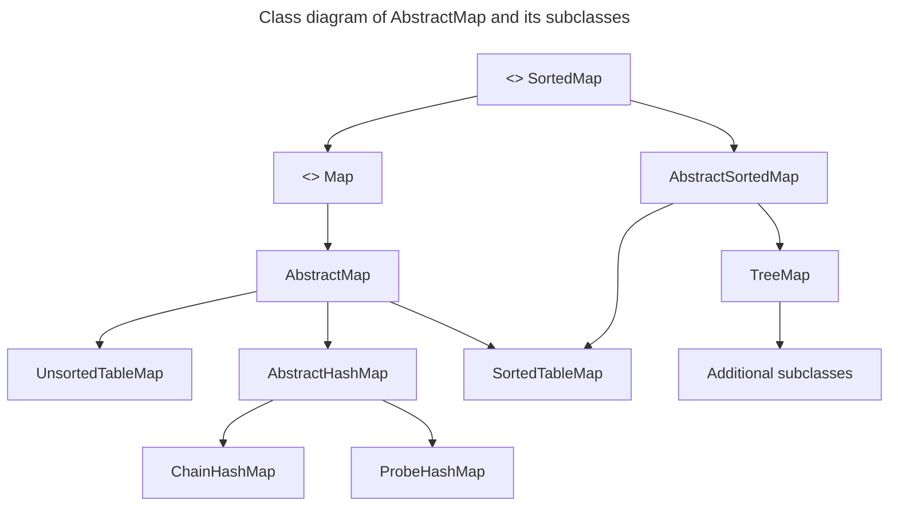
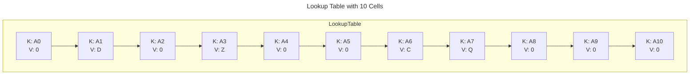

# Dati e Algoritmi

## Mappe
Una mappa è un ADT pensato per immagazzinare e ripescare valori unicamente tramite una **chiave di ricerca** associata a ciascun valore. Più in specifico, una mappa è una collezione di coppie chiave-valore, dove ogni chiave è associata ad un solo valore. Le operazioni principali che si possono effettuare su una mappa sono:
- `put(key, value)`: inserisce una nuova coppia chiave-valore nella mappa, o sovrascrive il valore associato ad una chiave già presente.
- `get(key)`: restituisce il valore associato alla chiave specificata.
- `remove(key)`: rimuove la coppia chiave-valore associata alla chiave specificata.
- `containsKey(key)`: restituisce `True` se la chiave specificata è presente nella mappa, `False` altrimenti.
- `size()`: restituisce il numero di coppie chiave-valore presenti nella mappa.
- `isEmpty()`: restituisce `True` se la mappa è vuota, `False` altrimenti.
- `values()`: restituisce una lista contenente tutti i valori presenti nella mappa.
- `entrySet()`: restituisce una collezione iterabile contenente tutte le coppie chiave-valore presenti nella mappa.

Le mappe sono note anche come array associativi, perché permettono di associare ad ogni chiave un valore. In Python, le mappe sono implementate tramite i dizionari, mentre in Java sono rappresentate dall'interfaccia `Map`. Però, in confronto ad un array tradizionale, una chiave di una mappa non dev'essere necessariamente numerico, e non deve per forza associare una posizione dentro la struttura. 

Delle applicazioni comuni delle mappe sono:
- Student ID (Key) -> Student Object (Value)
- Mappe DNS (Domain Name -> IP Address)
- Social Media (Username -> User Profile)
- Database aziendale di clienti (Customer ID -> Customer Object)
- Dizionario (Word -> Definition)
- ...


### Mappe nel package `java.util`
In Java, le mappe sono rappresentate dall'interfaccia `Map`, che definisce i metodi sopra elencati. Le classi che implementano l'interfaccia `Map` più comunemente utilizzate sono:
- `HashMap`: implementa una mappa basata su una tabella hash.
- `TreeMap`: implementa una mappa basata su un albero rosso-nero.
- `LinkedHashMap`: implementa una mappa basata su una tabella hash con ordinamento predefinito.
- `Hashtable`: implementa una mappa basata su una tabella hash, ma è thread-safe.

```java
// Interfaccia JAVA di un ADT Map, utilizza generics framework.
public interface Map<K,V> 
{
    int size();
    boolean isEmpty();
    V get(K key);
    V put(K key, V value);
    V remove(K key);
    Iterable<K> keySet();
    Iterable<V> values();
    Iterable<Entry<K,V>> entrySet();
}
```

Un esempio di utilizzo di una mappa in Java può esser mostrato con un counter di frequenza delle parole in un testo:
```java
public class WordCount 
{
    public static void main(String[] args)
    {
        Map<String, Integer> freq = new HashMap<>();
        Scanner doc = new Scanner(System.in).useDelimiter("[^a-zA-Z]+");

        while (doc.hasNext)
        {
            String word = doc.next().toLowerCase();
            Integer count = freq.get(word);
            if (count == null) count = 0;
            freq.put(word, count + 1);
        }

        int max = 0;
        String maxWord = "No Words!";

        for (Entry<String, Integer> ent : freq.entrySet())
        {
            if (ent.getValue() > max)
            {
                max = ent.getValue();
                maxWord = ent.getKey();
            }
        }

        System.out.println("The most frequent word is: " + maxWord);
        System.out.println("Its frequency is: " + max);
    }
}
```
### Classe astratta `AbstractMap`
La classe `AbstractMap` è una classe astratta che implementa l'interfaccia `Map` e fornisce una base comune per le implementazioni delle mappe. La classe `AbstractMap` fornisce implementazioni di alcuni metodi dell'interfaccia `Map`, come `equals()`, `hashCode()`, `toString()`, `keySet()`, `values()`, `entrySet()`, e `putAll()`. Le classi che estendono `AbstractMap` devono implementare i metodi `size()`, `get()`, `put()`, e `remove()`.


## Hash Tables
Una tabella hash è una struttura dati che implementa una mappa, ovvero una collezione di coppie chiave-valore, ed in generale è tra le strutture più comuni in uso, in quanto è tra le più efficienti. 

In questa rapresentazione, associamo una chiave k all'indice k della tabella. Le operazioni `get`, `put`, e `remove` sono implementate in complessità `O(1)` nel caso peggiore.