# Dati e Algoritmi

## Mappe
Una mappa è un ADT pensato per immagazzinare e ripescare valori unicamente tramite una **chiave di ricerca** associata a ciascun valore. Più in specifico, una mappa è una collezione di coppie chiave-valore, dove ogni chiave è associata ad un solo valore. Le operazioni principali che si possono effettuare su una mappa sono:
- `put(key, value)`: inserisce una nuova coppia chiave-valore nella mappa, o sovrascrive il valore associato ad una chiave già presente.
- `get(key)`: restituisce il valore associato alla chiave specificata.
- `remove(key)`: rimuove la coppia chiave-valore associata alla chiave specificata.
- `containsKey(key)`: restituisce `True` se la chiave specificata è presente nella mappa, `False` altrimenti.
- `size()`: restituisce il numero di coppie chiave-valore presenti nella mappa.
- `isEmpty()`: restituisce `True` se la mappa è vuota, `False` altrimenti.
- `values()`: restituisce una lista contenente tutti i valori presenti nella mappa.
- `entrySet()`: restituisce una collezione iterabile contenente tutte le coppie chiave-valore presenti nella mappa.

Le mappe sono note anche come array associativi, perché permettono di associare ad ogni chiave un valore. In Python, le mappe sono implementate tramite i dizionari, mentre in Java sono rappresentate dall'interfaccia `Map`. Però, in confronto ad un array tradizionale, una chiave di una mappa non dev'essere necessariamente numerico, e non deve per forza associare una posizione dentro la struttura. 

Delle applicazioni comuni delle mappe sono:
- Student ID (Key) -> Student Object (Value)
- Mappe DNS (Domain Name -> IP Address)
- Social Media (Username -> User Profile)
- Database aziendale di clienti (Customer ID -> Customer Object)
- Dizionario (Word -> Definition)
- ...


### Mappe nel package `java.util`
In Java, le mappe sono rappresentate dall'interfaccia `Map`, che definisce i metodi sopra elencati. Le classi che implementano l'interfaccia `Map` più comunemente utilizzate sono:
- `HashMap`: implementa una mappa basata su una tabella hash.
- `TreeMap`: implementa una mappa basata su un albero rosso-nero.
- `LinkedHashMap`: implementa una mappa basata su una tabella hash con ordinamento predefinito.
- `Hashtable`: implementa una mappa basata su una tabella hash, ma è thread-safe.

```java
// Interfaccia JAVA di un ADT Map, utilizza generics framework.
public interface Map<K,V> 
{
    int size();
    boolean isEmpty();
    V get(K key);
    V put(K key, V value);
    V remove(K key);
    Iterable<K> keySet();
    Iterable<V> values();
    Iterable<Entry<K,V>> entrySet();
}
```

Un esempio di utilizzo di una mappa in Java può esser mostrato con un counter di frequenza delle parole in un testo:
```java
public class WordCount 
{
    public static void main(String[] args)
    {
        Map<String, Integer> freq = new HashMap<>();
        Scanner doc = new Scanner(System.in).useDelimiter("[^a-zA-Z]+");

        while (doc.hasNext)
        {
            String word = doc.next().toLowerCase();
            Integer count = freq.get(word);
            if (count == null) count = 0;
            freq.put(word, count + 1);
        }

        int max = 0;
        String maxWord = "No Words!";

        for (Entry<String, Integer> ent : freq.entrySet())
        {
            if (ent.getValue() > max)
            {
                max = ent.getValue();
                maxWord = ent.getKey();
            }
        }

        System.out.println("The most frequent word is: " + maxWord);
        System.out.println("Its frequency is: " + max);
    }
}
```
### Classe astratta `AbstractMap`
La classe `AbstractMap` è una classe astratta che implementa l'interfaccia `Map` e fornisce una base comune per le implementazioni delle mappe. La classe `AbstractMap` fornisce implementazioni di alcuni metodi dell'interfaccia `Map`, come `equals()`, `hashCode()`, `toString()`, `keySet()`, `values()`, `entrySet()`, e `putAll()`. Le classi che estendono `AbstractMap` devono implementare i metodi `size()`, `get()`, `put()`, e `remove()`.

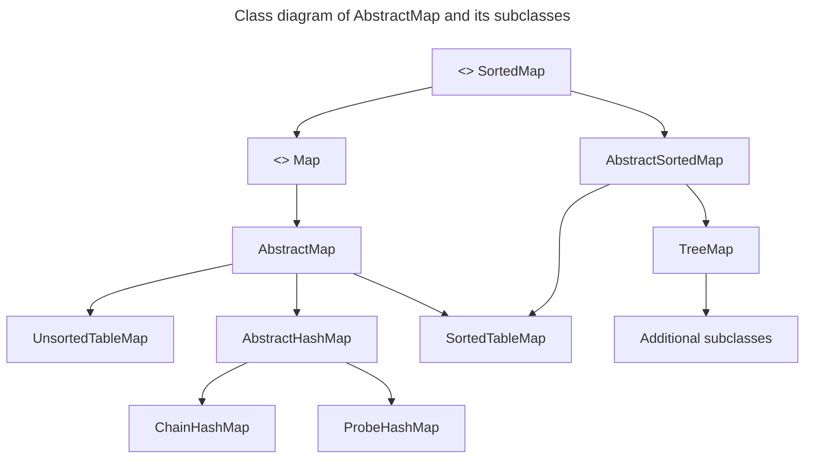
## Hash Tables e Hash Functions
Le **hash tables** e le **hash functions** sono strumenti fondamentali per organizzare e recuperare dati in modo rapido. 
### Hash Tables
Una tabella hash è una struttura dati che implementa una mappa, ovvero una collezione di coppie chiave-valore, ed in generale è tra le strutture più comuni in uso, in quanto è tra le più efficienti. 
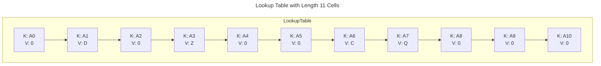
In questa rapresentazione, associamo una chiave k all'indice k della tabella. Le operazioni `get`, `put`, e `remove` sono implementate in complessità `O(1)` nel caso peggiore.

Però possono esserci due sfide nell'estendere questo framework:
1. Magari non vogliamo dedicare un array di lunghezza $N$ nel caso in cui $N >> n$. In questo caso, la tabella sarebbe sprecata.
2. Non dobbiamo, in generale, obbligare il fatto che le chiavi siano degli interi.

Da qui nasce l'idea di una funzione hash, che mappa una chiave ad un indice dell'array. Questa funzione è detta **hash function**. Idealmente, le chiavi saranno ben distribuite nel range da $0$ a $N-1$ da una **hash function**, ma in pratica potranno esserci due o più chiavi distintive che mappano alla stessa posizione. Dunque, dobbiamo concettualizzare la nostra tabella in un array di bucket, in cui in ogni bucket ci sono collezioni di entries associate a quella posizione specifica. Questa struttura è detta **bucket array**.

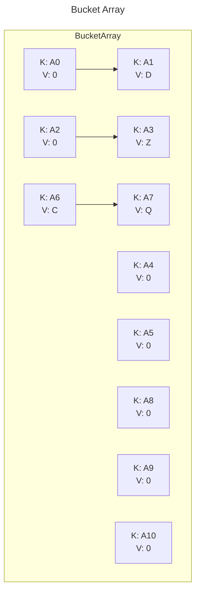

### Hash Function: il cuore delle Hash Tables
Una **Hash Function** ha l'obiettivo di mappare ogni chiave $k$ ad un intero nel range $[0,N-1]$ dove $N$ è la lunghezza dell'array. Questo processo è detto **hashing**. Una buona **hash function** dovrebbe:
- Essere efficiente da calcolare.
- Distribuire le chiavi in modo uniforme.
- Ridurre al minimo le collisioni.
- Essere deterministica.

Se ci sono due o più chiavi con lo stesso hash value, allora le chiavi verranno mappate nello stesso bucket $A$. In questo caso, possiamo dire che c'è una **collisione**, che generalmente è meglio evitare.
È comune vedere la valutazione di una hash function, $h(k)$, in due porzioni: 
1. **Hash Code:** Mappa una chiave $k$ ad un intero
2. **Compression function:** mappa il hash code ad un indice dell'array.

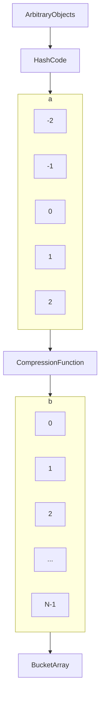
Il vantaggio di separare la hash function in due componenti è che possiamo cambiare la funzione di compressione senza dover ricalcolare l'hash code. Questo permette lo sviluppo di un hash code generalizzato, che può essere riutilizzato in diverse implementazioni.

Tutto ciò è particolarmente conveniente perché l'array di bucket può essere ridimensionato dinamicamente, a dipendere dal numero di entries presenti. Questo permette di mantenere un fattore di carico basso, e di mantenere le operazioni `get`, `put`, e `remove` in tempo costante.

### Hash Codes
Una funzione hash trasforma una chiave arbitraria  k  in un numero intero, chiamato hash code. Questo numero non deve necessariamente essere compreso in un intervallo specifico (ad esempio $[0, N-1]$) e può essere negativo. L’obiettivo è minimizzare le collisioni (quando due chiavi diverse producono lo stesso hash code).

Per i tipi di dato semplici (come `byte`, `short`, `int`, `char`), l’hash code può essere direttamente il valore intero del dato. Per tipi più complessi (come `long` o `double`), si combinano le parti “alte” e “basse” dei bit per produrre un hash code. Questo può avvenire sommando o applicando un’operazione exclusive-or (XOR) tra le due parti.

Metodi come la somma dei caratteri Unicode in una stringa producono spesso collisioni indesiderate. Ad esempio, stringhe come "temp01" e "temp10" o "stop" e "pots" possono avere lo stesso hash code.

#### Hash Code Polinomiale 
Un metodo più efficace per calcolare l’hash code di una stringa è il **hash code polinomiale**. Questo metodo calcola l’hash code di una stringa $s$ come:
$$
x_0a^{n-1} + x_1a^{n-2} + \dots + x_{n-2}a + x_{n-1} \text{ con } a \not={1}
$$
Questo metodo assegna maggiore importanza alla posizione dei caratteri nella chiave e distribuisce meglio i valori. Tramite la legge di Horner, si puo calcolare questo polinomio come:
$$
x_{n-1}+a\left(x_{n-2}+a\left(x_{n-3}+\dots+a\left(x_1+ax_0\right)\dots\right)\right)
$$
Questo metodo è molto più efficiente rispetto alla somma dei caratteri Unicode, e riduce le collisioni.

#### Cyclic-Shift Hash Codes
Il **cyclic-shift hash code** è una variante dell'hash code polinomiale che, invece di moltiplicare per una costante $a$, utilizza uno **spostamento ciclico** di un determinato numero di bit per variare i bit di un valore parziale.
    
##### Come funziona?
Uno spostamento ciclico prende un certo numero di bit dalla parte più a sinistra (high-order) di un valore binario e li sposta alla fine, sulla destra (low-order). Per esempio:

## Graphs
Un grapho è un modo di rappresentare una relazione che esiste tra coppie di oggetti. Quindi, un grafo è un set di oggetti, chiamati vertici, insieme ad una collezione di archi (coppie di vertici).

Il grafo si dice **diretto** se ogni arco $(u,v)\in E$ è una coppia ordinata $(u\rarr v)$, altrimenti si dice non diretto $(u-v)$.

> #### Grafo non diretto
>```mermaid
>graph LR
>    0 --- 5
>    0 --- 1
>    0 --- 2
>    0 --- 6
>    5 --- 3
>    5 --- 4
>    4 --- 3
>    4 --- 6
>    7 --- 8
>    9 --- 10
>    9 --- 11
>    11 --- 12
>    9 --- 12
>```


> #### Grafo diretto
>```mermaid
>graph LR
>    0 --- 5
>    0 --- 1
>    0 --- 2
>    2 --- 3
>    3 --- 2
>    0 --- 6
>    5 --- 3
>    5 --- 4
>    4 --- 3
>    4 --- 6
>    6 --- 7
>    6 --- 8
>    8 --- 6
>    7 --- 9
>    9 --- 10
>    9 --- 11
>    10 --- 12
>    11 --- 12
>    11 --- 4
>    9 --- 12
>```

La definizione ammette la presenza di archi multipli tra due ertici (per questo $E$ è una collezione e non un insieme), e di archi (u,u) chiamati **self loop**.

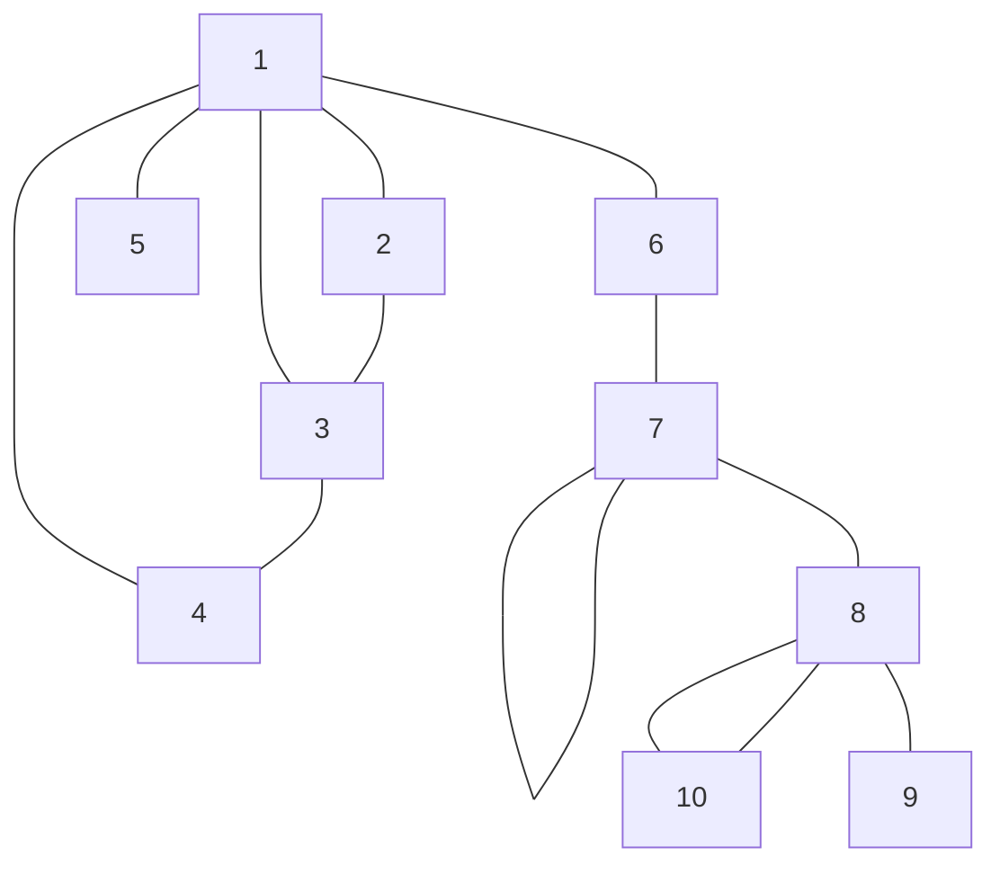

Un grafo semplice è un grafo senza archi multipli e senza self loop. Per alcune applicazioni agli archi sono associati dei pesi, che possono rappresentare distanze, costi, tempi, o qualsiasi altra quantità.


## Grafi Semplici e Non Diretti

Un grafo si dice **semplice** se non ha archi multipli e self loop. Un grafo si dice **non diretto** se ogni arco è una coppia non ordinata di vertici. Un grafo non diretto si dice **connesso** se per ogni coppia di vertici esiste un cammino che li collega.

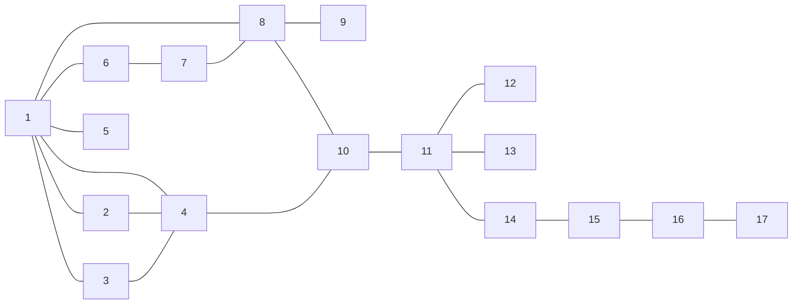

### Concetti fondamentali: cammino

Cammino (path): $u_1, u_2,\cdots, u_k$ con $(u_i, u_{i+1})\in E$ per $1\leq i < k$. 

Un **cammino** in un grafo è una sequenza di vertici in cui ogni vertice è collegato al successivo da un arco. Un cammino è **semplice** se non attraversa lo stesso arco due volte. Un cammino è **ciclo** se il primo e l'ultimo vertice sono lo stesso. Un grafo è **aciclico** se non contiene cicli.

La lunghezza del cammino si misura in numero di archi. Nel caso di archi pesati, la lunghezza è la somma dei dei pesi degli archi.

> Il cammino si dice **semplice** se non ha vertici ripetuti. Di solito si omette l'aggettivo semplice anche se si parla di cammino semplice.


### Concetti fondamentali: cammino minimo e distanza

Dati due vertici $x,y\in V$, il cammino minimo tra x e y, se ne esiste uno, è un cammino $x=u_1,u_2,\cdots,u_k=y$ tale che la lunghezza sia minima. La sua lunghezza è detta distanza $d(x,y)$ tra $x$ e $y$. Se non esiste alcun cammino tra $x$ e $y$, per convenzione si considera $d(x,y)=\infty$.

## Concetti fondamentali: ciclo

Un ciclo è un cammino in cui il primo e l'ultimo vertice sono lo stesso. Un grafo si dice **aciclico** se non contiene cicli.

Il ciclo si dice semplice se non ha vertici ripetuti tranne gli estremi. Di solito si omette l'aggettivo semplice anche se si parla di ciclo semplice.

## Concetti fondamentali: sottografo

Un grafo $G'=(V',E')$ si dice sottografo di un grafo $G=(V,E)$ se $V'\subseteq V$ e $E'\subseteq E$, e tale che gli archi di $E'$ incidono solo su $V'$.
## Concetti fondamentali: sottografo di copertura

Un sottografo di copertura di un grafo $G=(V,E)$ è un sottografo $G'=(V',E')$ tale che $V'\subseteq V$ e $E'\subseteq E$ e $V'$ contiene tutti i vertici di $G$.

## Concetti fondamentali: grafo connesso

Un grafo si dice connesso se per ogni coppia di vertici esiste un cammino che li collega. Un grafo connesso è un grafo in cui esiste un cammino tra ogni coppia di vertici.

## Concetti fondamentali: grafo disconnesso

Un grafo si dice disconnesso se esiste almeno una coppia di vertici per cui non esiste un cammino che li collega. Un grafo disconnesso è un grafo in cui esistono due vertici che non sono collegati da un cammino.

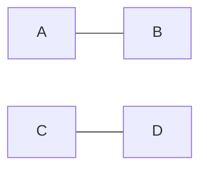

## Concetti fondamentali: componenti connesse

Le componenti connesse (connected component) di un grafo $G=(V,E)$ sono i sottografi connessi massimali di $G$, ovvero la famiglia di sottografi $G_i=(V_i,E_i)$ con $1 \leq i \leq k$ tali che:
- $G_i = (V_i, E_i)$ è connesso, per $1 \leq i \leq k$
- $V = V_1 \cup V_2 \cup \ldots \cup V_k$ (partizione: $V_i \cap V_j = \emptyset \space \forall \space i \neq j$)
- $E = E_1 \cup E_2 \cup \cdots \ cup \ E_k$ (partizione: $E_i \cap E_j = \emptyset \space \forall \space i \neq j$)
- $\forall i \not= j$ non esistono archi in $E$ tra $V_i$ e $V_j$

## Concetti fondamentali: albero

Un albero radicato (rooted tree) è un grafo $G=(V,E)$ tale che:
- esiste un vertice radice $r \in V$
- Per ogni $u \in V$, con $u \not= r$, esiste un unico padre $p(u \in V)$ e si ha che $E=\{(u, p(u)) : u \in V, u \not= r\}$.

Un albero libero è un grafo connesso e senza cicli.

Una foresta è un grafo senza cicli, ovvero un insieme di alberi liberi disgiunti.

Si noti che un albero ò anche una foresta ma non vale il contrario.

---

- Le visite sono DESIGN PATTERN ALGORITMICI che permettono di visitare tutti i vertici di un grafo.
- Una semplice scansione di vertici e archi senza un ordine preciso non permetterebbe la soluzione efficiente di molti problemi. Dunque, è la sistematicità della visita che risulta cruciale e strumentale per la risoluzione efficiente dei problemi.

### Breadth-First Search (BFS)

Sia G:=(V;E) un grafo semplice, non diretto e non pesato: 

- Dato $S \in V, C_s \subseteq G$ denota la componente connessa di $G$ contenente $S$
  - Tutti i vertici raggiungibili da $S$ con cammini e gli archi su essi incidenti.
- Ricordiamo che dati due vertici $x,y \in V$ nella stessa componente connessa, la loro distanza $d(X,Y)$ è definita lunghezza di un cammino da x a y. Se i vertici sono in componenti connesse distinte, si assume $d(x,y)=+\infty$

Assunzioni sull'implementazione di G=(V,E):
- per ogni vertice v \in V essite un campo v.ID che vale 1, se v è stato visitato, e vale 0 altrimenti
- Per ogni arco e \in E esiste un campo e.label che memorizza una opportuna etichetta oppure vale null se e non ha ancora etichetta
- Per ogni v 1in V, incidentEdges(v) restituisce un iteratore agli archi incidendi su v che possono essere enumerati in tempo \theta(1) ciascuno
- Per ogni arco e = (v,w) \in E, opposite(v,e) restituisce l'altro vertice di e, ovvero w se v=w e v se v=w

Il seguente design pattern permette la visita di tutto il grafo, nel caso esso non sia connesso. Esso suppone di poter enumerare vertici e archi generando il prossimo vertice/arco in tempo costante.

Dato $G=(V,E)$ con $|V| = n$ e $|E| = m$, la complessità computazionale di BFS è $O(n+m)$ per i seguenti problemi:
- testare se G è connesso
- trovare le componenti connesse di G
- trovare uno spanning tree di G se G è connesso

### Depth-First Search (DFS)

`DFS` è un algoritmo ricorsivo che, a partire da un vertice $s$:

- visita tutti i vertici di $C_s$
- etichetta ciascun arco di $C_s$ come `DISCOVERY` o `BACK EDGE`

Si usano le stesse ipotesi implementative della BFS.

- Algoritmo: DFS(G,s)
- Input: grafo $G=(V,E),v\in V$
- Output: visita ogni vertice raggiungibile da v e non ancora visitato, ed etichetta ogni arco esaminato come `DISCOVERY` o `BACK EDGE`

```java
forall (e in G.incidentEdges(v)) do
{
    if (e.label is null)
    {
        w = G.opposite(v,e);
        if (w.ID == 0)
        {
            e.label = "DISCOVERY";
            DFS(G,w);
        }
        else
            e.label = "BACK EDGE";
    }
}         
```

Si aprono nell'ordine le seguenti invocazioni di DFS(G,i) con i=1,2,3,4,5,6 che etichettano gli archi in questo modo:

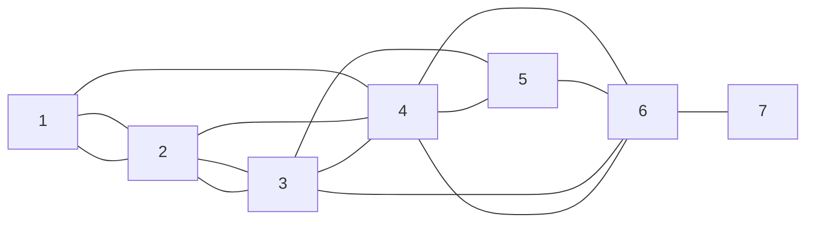

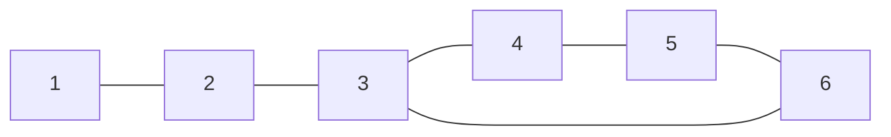

Arrivati alla invocazione `DFS(G,6)`, essa etichetta `(6,3)` come `BACK EDGE` e invoca `DFS(G,4)` etichettando `(6,4)` come `DISCOVERY EDGE`.

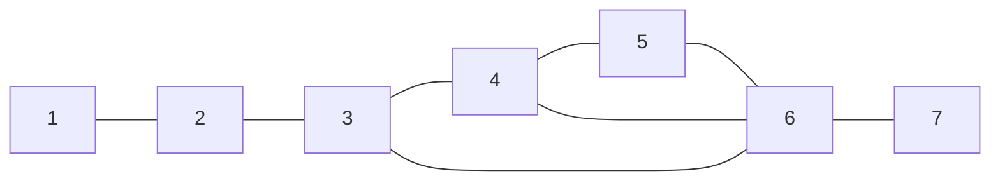

DFS(G,4) etichetta (1,4) e (2,4) come `BACK EDGE` e termina la sua esecuzione. Il controllo ripassa a DFS(G,6) che invoca DFS(G,7) etichettando (6,7) come `DISCOVERY EDGE`. A questo punto si chiudono tutte le invocazioni aperte, in quest'ordine, quindi i = 7,6,5,3,2,1, e la DFS termina l'esecuzione.

Per comprendere meglio il significato di `BACK EDGE`, si consideri il grafo non diretto:

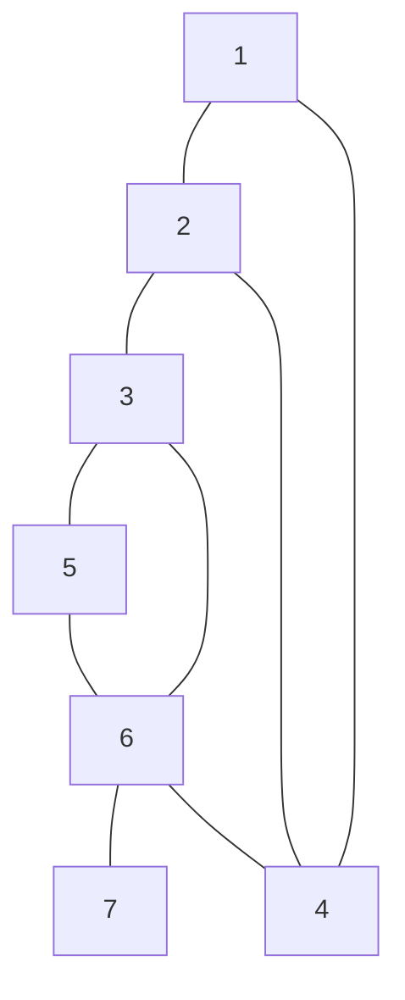

Si supponga di eseguire `DFS(G,s)` e che, all'inizio, nessuno dei vertici/archi di C_s sia visitato/etichettato. A fine esecuzione si ha che:
- tutti i vertici sono visitati e tutti gli archi sono etichettati come `DISCOVERY EDGE` o `BACK EDGE`
- I `DISCOVERY EDGE` formano uno spanning tree T di C_s radicato in s

La dimostrazione è analoga a quella della BFS.

#### Complessità di `DFS(G,s)`
Si supponga di eseguire `DFS(G,s)` e che, all'inizio, nessuno dei vertici/archi di C_s sia visitato/etichettato. La complessità di `DFS(G,s)` è $\Theta(m_s)$ dove $m_s$ è il numero di archi in $C_s$.

Consideriamo l'albero della ricorsione per l'invocazione `DFS(G,s)`:
- dalla proposizione precedente e dal fatto che per costruzione la DFS non può essere invocata due volte sullo stesso vertice, possiamo dedurre che il numero di invocazioni ricorsive è pari al numero di vertici di $C_s$, e c'è un'invocazione per ogni vertice di $C_s$
- il numero di operazioni eseguite da `DFS(G,v)` escluse le chiamate ricorsive al suo interno sono proporzionali a $\Theta(deg(v))$, il grado di v $\implies$ la complessità di `DFS(G,s)` è $\Theta(\sum_{\text{v vertice di }C_s} degree(v)) = \Theta(m_s)$ dove $m_s$ è il numero di archi in $C_s$.

