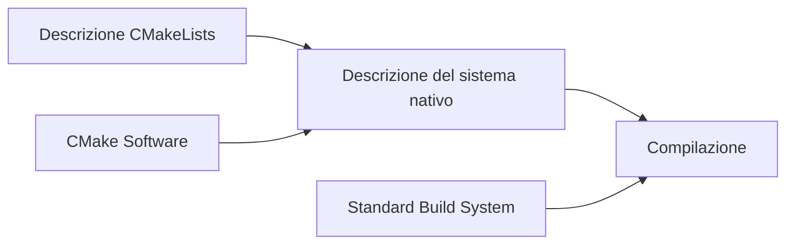

<!-- -->
# Laboratorio Programmazione

## Contatto professore
- **Stefano Ghidoni**  
  - Email: [stefano.ghidoni@unipd.it](mailto:stefano.ghidoni@unipd.it)  
  - Telefono: 049 827 7934  

## Ricevimento
- Su appuntamento

## Libri consigliati
- [Programming Principles and Practice Using C++](https://www.lafeltrinelli.it/programming-principles-practice-using-c-libro-inglese-bjarne-stroustrup/e/9780321992789?awaid=9507&gad_source=1&gbraid=0AAAAAC8kHMQAbfgOpgxfhEL71egZi7UYf&gclid=EAIaIQobChMIsfTVgq_viAMVMJSDBx3q0y9iEAQYASABEgKV0_D_BwE&awc=9507_1727860791_1ace83705e0928cde50c3f7bdda2f9ec) - Bjarne Stroustrup  

---
---

# Funzioni - 10 Ottobre
- In C++ il passaggio di argomenti è **per valore**.
- Un argomento è una variabile locale della funzione:
  - Inizializzata a ogni chiamata
  - Valore copiato
- **Problemi di efficienza con vector**:
  - Evitare la copia ed accedere direttamente ai dati passati come argomento:
    - Utilizzare **puntatori** o **reference**:
      - `&` permette che l’argomento si riferisca all’oggetto definito nel chiamante.
      - Il codice può risultare meno espressivo.

### Reference e Conversioni
- Le reference possono essere utilizzate in altri contesti.
- Passaggio per riferimento:
  - **Protezione dei dati**: utilizzare `const` per consentire solo lettura.
  - Passare una reference non costante e non scrivere è considerato sbagliato.
- Conversioni esplicite con `static_cast<>`.

---
---

# Classi - 14 Ottobre
- La classe rappresenta un concetto nel programma:
  - Specifica:
    - Rappresentazione degli oggetti
    - Creazione, uso e distruzione degli oggetti

## Enumerazioni
- **Interfaccia vs implementazione**:
  - **Interfaccia (public)**:
    - Punto di vista dell’utente, accessibile.
  - **Implementazione (privata)**:
    - Punto di vista dell’implementatore, non accessibile direttamente.

## Struct
- Variante delle classi:
  - Membri di default sono **pubblici**.
  - Usate per dati senza funzioni.

---
---

# Puntatori - 21 Ottobre
- Variabili che contengono indirizzi di memoria.
- **Sintassi**:
  ```cpp
    int* ptr = &var;
  ```
- **Operazioni**:
  - Prendere l'indirizzo di una variabile: &.
  - Dereferenziamento: * (accesso al contenuto puntato).
  - Puntatore void*:
  - Puntatore a memoria raw, usato con cast espliciti (static_cast).

## Puntatori e Reference
- Una reference è immutabile e dereferenziata automaticamente.

# Vector - 28 Ottobre
- Struttura dinamica, diversamente dagli array a dimensione fissa.
- Utilizza la memoria dinamica con:
```cpp
    double* ptr = new double[n];
```
- Liberare memoria:
- Efficienza: evita garbage collector.
- Controllo: decide quando rilasciare memoria.

Nota
- *p e p[0] sono equivalenti: applicare [] a un puntatore è come trattare la memoria come un array.
---
---
# Progettare una classe
## Const e helper functions

### Date
```cpp
class Date {
    int y, m, d;
    
    public:
    Date (int y, int m, int d);
    void add_day(int n);
    int month() { return m; }
    int day() { return d; }
    int year() { return y; }
};
```
``` cpp
void some_function(Date& d, const Date& state_of_term)
{
    int a = a.Day(); // ok
    int b = start_of_term.Day(); // dovrebbe essere ok
    d.add_day(3); // ok
    start_of_term.add_day(3); // errore!!
}
```

La chiamata a `Month::day()` applicata a un `const Date&` non garantisce che l'oggetto non sarà modificato. `Day()` in effetti non modifica l'oggetto, ma ciò non è esplicito. La soluzione sarebbe dichiarare Day() come funzione membro const.
``` cpp
class Date 
{    
    public:
    // ...
    int day() const;
    Month month() const;
    int year() const;
    void add_day(int n);
    void add_month(int n);
    void add_year(int n);
    // ...
    
    private:
    int y;
    Month m;
    int d;
};
```

### Funzioni membro vs Helper Function
Una funzione che può essere implementata in modo semplice, elegante ed efficiente come funzione autonoma (cioè, una funzione non membro) dovrebbe essere implementata al di fuori della classe. In questo modo, un bug in quella funzione non può corrompere direttamente i dati in un oggetto della classe.

In caso di dati membro corrotti, solo le funzioni membro devono essere controllate.

Passare da helper function a funzioni membro abilita la protezine dei dati, ma il ruolo della helper function ci permette di utilizzare spesso argomenti della classe di cui sono helper. Non è sempre ocsì, non è una regola. Degli esempi tipici sono `operator==` e `operator !=` sono tipiche helper function.

Spesso le helper function sono inserite in un namespace assieme alla classe

```cpp
namespace Chrono
{
    enum class Month {...}
    class Date {...}
    Date next_sunday(const Date& d) {...}
    Date next_workday(const Date& d) {...}
}
```
``` cpp
Date next_sunday(const Date& d)
{
// accedere utilizzando d.day(), d.month(), d.year()
// creare una nuova Date da ritornare
}

Date next_weekday(const Date& d) { /* ... */ }
bool leapyear(int y) { /* ... */ }
bool operator==(const Date& a, const Date& b)
{
    return a.year() == b.year()
    && a.month() == b.month()
    && a.day() == b.day();
}

bool operator!=(const Date& a, const Date& b)
{ 
    return !(a==b); 
}
```
## Costruttori di Default e Valori di Default
Alcuni principi generali per una buona interfaccia sono:
- L'interfaccia deve essere completa
- L'interfaccia deve essere minimale
- Devono essere forniti i costruttori
- La copia deve essere supportata o proibita
- Usare tipi adeguati per controllare gli argomenti
- Identificare le funzioni membro costanti
- Liberare tutte le risorse nel distruttore

```cpp
class Date 
{
    int y, m, d;

    public:
    Date (int y, int m, int d);
    void add_day(int n);
    int month() { return m; }
    int day() { return d; }
    int year() { return y; }
};
```
La classe Date ha un costruttore che accetta tre argomenti, ciò rende illegale la definizione senza argomenti.

```cpp
Date d0; // errore: nessuna inizializzazione
Date d1 {}; // errore: inizializzatore vuoto
Date d2 {1998}; // errore: argomenti insufficienti
Date d3 {1, 2, 3, 4}; // errore: troppi argomenti
Date d4 {1, "jan", 2}; // err: tipi sbagliati
Date d5 {1, Month::jan, 2}; // ok!
Date d6 {d5}; // ok: costruttore di copia
```

Ma esiste un valore per cui ha senso un valore di default?
Spesso esistono dei valori di default significativi, per esempio: 
- string: stringa vuota;
- vector: vettore vuoto

In questi casi ha senso prevedere un costruttore di default. Costruttori di default per tipi built-in: 0.
Questo ha una forte influenza sull'interfaccia!
```cpp
// chiamate esplicite
string s1 = string{};
vector<string> v1 = vector<string> {};
// equivalenti, ma più compatte e semplici
string s1;
vector<string> v1;
// tipi built-in
int {}; double {}; // int inizializzato a 0
// double inizializzato a 0.0
```
I valori di defaultdei membri possono essere inseriti usando il costruttore di default, nella definizione dei membri stessi, oppure nella definizione!
```cpp
class Date {
    public:
        Date();
        Date(int y, Month m, int d);
        Date(int y);
    private:
        int y {2001};
        Month m {Month::jan};
        int d {1};
}
```
## Inizializzazione
Riprendiamo vector
```cpp
class vector {
    int sz;
    double* elem;

    public:
    vector(int s = 0)
        : sz{s}, elem{new double[s]} { 
            if(s == 0) elem = nullptr; 
        }
    ~vector()
        { delete[] elem; }
    // ... - include push_back(double d)
};
```
Al momento possiamo soltanto inizializzare usando:
```cpp
vector v3;
v3.push_back(1.2);
v3.pushback(7.89);
v3.pushback(12.34);
```
Ma noi vogliamo poter inizializzare il vettore nel solito modo:
```cpp
vector v1 = {1.1, 2.3, 12.34} // più compatto
```
Usando una scrittura così fornisceu n oggetto della std library di tipo `initializer_list<T>`, e possiamo dunque aggiungere questo costruttore:
```cpp
class vector {
    // ...
    vector(initializer_list<double> lst)
        : sz{lst.size()}, elem{new double[sz]}
    {
        copy(lst.begin(), lst.end(), elem);
    }
    // ...
};
```
Copy algorithm: copia una sequenza di elementi delimitata dai suoi primi due argomenti a una sequenza puntata dal terzo argomento. Iteratori per la definizione della sorgente.
Osserviamo un dettaglio... è passato per copia! `initializer_list` è usato in questo modo, come richiesto dal linguaggio. è un handle a elementi allocati "altrove".

Le seguenti sono entrambi corrette:
```cpp
vector v1 {3};  // inizializzato con un valore pari a 3
vector v2(3);   // inizializzato con 3 slot non inizializzati
```

```cpp
// è uguale, con o senza uguale
vector v1 = {1,2,3};
vector v2 {1,2,3};
```

## Copia oggetti
In C++, la copia degli oggetti può essere gestita in diversi modi. 

```cpp
void f(int n)
{
    vector v(3);
    v.set(2, 2.2);
    vector v2 = v; // Che succede qui?
}
```
Di default, copia membro per membro.

### Copia Superficiale vs Copia Profonda
- Copia Superficiale (Shallow Copy): Copia i valori dei membri dell'oggetto. Se l'oggetto contiene puntatori, solo gli indirizzi vengono copiati, non i dati a cui puntano.
    - Può essere molto veloce.
    - Può dar problemi coi distruttori. Rimarrebbe un dangling pointer.
- Copia Profonda (Deep Copy): Copia i dati effettivi a cui i puntatori fanno riferimento, creando nuove istanze dei dati.
```cpp
vector::vector(const vector& arg)
    :sz{arg.sz}, elem{new double[arg.sz]}
{
    copy(arg.elem, arg.elem+sz, elem);
}
```
Ora il comportamento è diverso - deep copy:
```cpp
vector v2 = v;
vector v2 {v};
```

### Assegnamento di copia
```cpp
class vector {
    int sz;
    double* elem;
public: 
    vector& operator=(const vector& a);
    // ...
}
```
come potrebbe essere implementata questa funzione membro?
```cpp
vector& vector::operator=(const vector& a)
{
    double* p = new double[a.sz]; // alloca nuovo spazio
    copy(a.elem, a.elem+a.sz, p); // copia gli elementi
    delete[] elem;
    elem = p;
    sz = a.sz;
    return *this;                 // ritorna self-reference
}
```
L'assegnamento è leggermente diverso dal costruttore, deve gestire dati vecchi.
Procedimento proposto:
- creare una copia dei dati di source
- eliminari gli elementi vecchi
- far puntare elem ai dati nuovi

Perché non eliminare i dati vecchi prima per risparmiare un puntatore? Perché non è una buona idea elminare dei dati finché non siamo sicuri di poterli rimpiazzare. Pur non essendo molto utile, dev'essere gestito correttamente dalla classi.
```cpp
v = v
```

## Spostamento di oggetti
```cpp
vector fill(istream& is)
{
    vector res;
    for (double x; is >> x; ) res.push_back(x);
    return res;
}

void use()
{
    vector vec = fill(cin);
    // uso di vec
}
```
Ha un effetto indesiderato, un problema di efficienza. Non vogliamo copiare, e non possimao usare res dopo il return, quindi non possimao usare contemporaneamente res e vec. Esiste un modo per spostare i dati, invalidando la sorgente. Ciò che cerchiamo è un'operazione di `move`.
```cpp
class vector {
    int sz;
    double* elem;

    public:
    vector(vector&& a); // move constructor
    vector& operator=(vector&&); / move assignment
}
```
La notazione `&&` è chiamata rvalue reference. Gli argomenti non sono const, e non possono esserlo. Le definizioni di operazioni di move tendono ad essere più semplici delle copie.
```cpp
vector::vector(vector&& a)
    : sz{a.sz}, elem{a.elem}
{
    a.sz = 0; a.elem = nullptr;
    // annulla a
}
vector& vector::operator=(vector&& a)
{
    delete[] elem;
    elem = a.elem;
    sz = a.sz;
    a.elem = nullptr;
    a.sz = 0;
    return *this;
}
```

Riprendendo l'esempio iniziale...
```cpp
vector fill(istream& is)
{
    vector res;
    for (double x; is >> x; ) res.push_back(x);
    return res; // Return implementato tramite move constructor
}

void use()
{
    vector vec = fill(cin);
    // uso di vec
}
```
A priori, comunque, è il compilatore a decidere in automatico se usare costruttori copy o move, rileva automaticamente le condizioni per usare il move.
Il progettista fornisce lo strumento, il compilatore decide quando usarlo. Se non è presente il move constructor: copy constructor e distruttore.

In certe cirostanze il move constructor non è chiamato, ma sostituito da una tecnica di ottimizzazione del compilatore - copy elision. L'oggetto è costruito direttamente nella funzione chiamante. 
è possibile richiedere al compilatore di non applicare la copy elision.

`opzione -fno-elide-constructors`


## Accedere ai membri
Fino ad ora vector è letto e scritto con le funzioni membro `get()` e `set()`. Però, è più naturale un'interfaccia con `operator[]`.
```cpp
class vector {
    int sz;
    double* elem;

public:
    double operator[] (int n)
    {
        return elem[n];
    }
}
```
però `operator[]` non permette di gestire questa seguente situazione:
```cpp
vector v(10);
double x = v[2]; // ok
v[3] = x;        // errore: v[3] non è un lvalue
```
Una possibile soluzione sarebbe utilizzare un puntatore..
```cpp
double* operator[] (int n)
{
    return &elem[n];
}

*v[3] = x; // ok, ma brutto e interazione innaturale
```

Si potrebbe fare una reference:
```cpp
class vector {
    int sz;
    double* elem;

public: 
    double& operator[] (int n)
    {
        return elem[n];
    }
}
```
però non posso accedere ad oggetti costanti, dunque...
```cpp
class vector {
    int sz;
    double* elem;

public: 
    double& operator[] (int n);
    double operator[] (int n) const;
}
```
Con la versione const è ora possibile ritornare una copia o una const reference.

# Template

Un template in C++ è un meccanismo che permette di scrivere _codice generico_, consentendo a classi e funzioni di operare su tipi di dati diversi senza duplicare il codice. Il compilatore genera il codice necessario per *ogni tipo* per cui il template è specializzato.
```cpp
vector<double>
vector<int>
vector<Month>
vector<char>
<vector<vector<double>>>
```

### Class Template
Un class template, chiamato anche _type generator_, _parametrized type_, o _parametrized class_, è una classe parametrizzata su uno o più tipi. 

La notazione è la seguente:
Il processo di generazione di una classe su un tipo specifico è chiamato _specializzazione_ (specialization) o _template instantiation_.
```cpp
vector<char>
```
Questo avviene a tempo di compilazione. 
| Pro | Contro |
|-----|---------|
| Controllo degli errori a compile-time | Aumento dimensione del codice binario |
| Migliori prestazioni runtime | Tempi di compilazione più lunghi |
| Type safety garantita | Necessità di scrivere codice per ogni tipo |
| Nessun overhead runtime | Messaggi di errore più complessi |


```cpp
// come creare il template
template <typename T> // più moderno
template <class T>    // più tradizionale, significa "tipo" (BS)

// in realtà funzionano allo stesso identico modo
```

Sostituzione di un tipo generico T a double
```cpp
template <typename T>
class vector {
    int sz;
    T* elem; // T essendo un tipo, posso prenderne un puntatore
public:
    vector() : sz{0}, elem{nullptr} {}
    explicit vector(int s) : sz{s}, elem{ new T[s]} {
        for (int i = 0; i < sz; ++i) elem[i] = 0;
    }

    // explicit impedisce di fare la conversione automatica
};
```
Le funzioni membro della class template seguono la stessa specializzazione.
```cpp
template <typename T>
void vector<T>::push_back(const T& d) {/* ... */}
```
Da questo, il compilatore genera
```cpp
void vector<string>::push_back(const string& d) {/* ... */}
```

### Function template
È possibile parametrizzare anche le funzioni. Quando parametrizziamo una funzione otteniamo una _function template_.
Per esempio..
```cpp
template <typename T>
T myMax(T x, T y)
{
    return (x > y) ? x : y;
}
```
È necessario usare un template in questo caso perché vogliamo che la funzione funzioni con qualsiasi tipo di dato che supporti l'operatore `>`.
Su `T`, stiamo assumendo che il tipo supporti l'operatore di confronto `>` e che sia copiabile.
Per chiamare la funzione:
```cpp
int x = i, j = 5;

int max = myMax<int>(i, j);
```
---
---
# Accessi, puntatore This, Progetti Complessi, CMake - 18 Novembre
## Accessi
### Accesso tramite reference
Fino ad ora vector è letto e scritto con le funzioni membro get() e set().
È più naturale un'interfaccia com `operator[]`. 
```cpp
class vector{
    int sz;
    double* elem;   // implicitamente privato

    public: 
    double& operator[] (int n);
    double operator[] (int n) const;
    // overloading per poter leggere e scrivere.
}
```
Con la versione const è possibile ritornare una copia o una const reference.
La seconda versione di `operator[]` ritorna una reference a membro privato. Però facendo così violiamo l'incapsulamento della classe. Ricordiamo che private non vuol necessariamente dire che "questa memoria può essere modificata solo dalle funzioni membro", ma in realtà vuol dire "diretti tentativi di accesso a questa variabile risulteranno in un errore in compilazione". Quando esponi una reference all'oggetto, stai esponendo la memoria stessa. 

## Puntatore this
Il puntatore `this` è un puntatore implicito che punta all'oggetto corrente. È un puntatore costante, non può essere modificato. Lo abbiamo già visto in utilizzo nell'assegnamento di copia:
```cpp
vector& vector::operator(const vector& a)
{
    double* p = new double[a.sz]; // alloca nuovo spazio
    copy(a.elem, a.elem+a.sz, p); // copia gli elementi
    delete[] elem;
    elem = p;
    sz = a.sz;
    return *this;                 // ritorna self-reference
}
```
`this` è l'unico modo per accedere all'operando di sinistra. È un puntatore all'oggetto stesso, è un parametro implicito delle funzioni.
È un parametro implicito delle funzioni membro, generato automaticamente 
- È usato quando è necessario usare un riferimento all'oggetto corrente
- Ad esempio, nell'overloading di operator=
```cpp
// questione di stile, a preferenza
int vector::size() const { return sz; }
int vector::size() const { return this->sz; }
```

## Recap elementi essenziali di una buona interfaccia
### Regole di progettazione
Le operazioni essenziali da considereare per una classe sono:
- Costruttore con uno o più argomenti
- Costruttore di default
- Costruttore di copia (copy constructor)
- Assegnamento di copia (copy assignment)
- Costruttore di spostamento (move constructor)
- Assegnamento di spostamento (move assignment)
- Distruttore   
  - Necessario se acquisiamo **risorse** (che devono essere liberate)
    - **risorse:**
      - memoria nel freestore
      - file
  
Senza move e copy constructor non muore nessuno, però potrebbe essere meno efficiente.
Da notare, non è una checklist di cose da fare, ma bensì una lista di cose da considerare.

È importante osservare che 
```cpp
vector<double> vi(10);
vector<string> vs(10);
vector<vector<int>> vvi(10);
```

funzionano solo perché esistono i costruttori di default di:
- `double`
- `string`
- `vector<int>` e `int`

Questo sottolinea l'importanza del costruttore di default. Quando va a preallocare, il costruttore deve chiamare il costruttore degli singoli elementi.

Se è necessario un distruttore, probabilmente sono necessari anche:
- Costruttore di copia (copy constructor)
- Assegnamento di copia (copy assignment)
- Costruttore di spostamento (move constructor)
- Assegnamento di spostamento (move assignment)

Un costruttore che riceve un singolo argomento definisce una conversione da quell'argomento alla classe. 
Puo essere utile:
```cpp
class complex {
    public:
        complex(double);        // conversione da double a complex
        complex(double, double);
};

complez z1 = 3.14;              // ok: conversione
complex z2 = complex {1.2, 3.4};
```
A volte può essere indisiderata la conversione, ad esempio la *nostra classe vector* ha un costruttore che accetta un int, usato per costruire vettori di n elementi. 
```cpp
class vector {
    vector(int);
}

vector v = 10;
v = 20;

void f(const vector&);
f(v);
```

Si può eliminare la conversione implicita con la keyword explicit
```cpp
class vector {
    explicit vector(int);
}

vector v = 10;          // errore
v = 20;                 // errore
vector v0(10);          // ok!

void f(const vector&);
f(10);                  // errore
f(vector(10));          // ok!
```

Un costruttore può essere chiamato in modi e momenti diversi.
Costruttore chiamato quando si crea un oggetto:
- Oggetto inizializzato
- New
- Oggetto copiato

Distruttore chiamato quando:
- Un nome esce dallo scope
- È usato delete

```cpp
// da copiare e importare la struct X
struct X {
    int val;
    void out(const string& s, int nv) {
        cerr << this << "->" << s << ": " << val << "(" << nv << ")\n";
    }
    // continuare
}
```

Una copia di un oggetto non utilizzato non può essere eseguita, il compilatore **è autorizzato** a ritenere che un costruttore di copia esegua solamente una copia, e nient'altro.
## Progetti Complessi
### Progetti su più file
I progetti complessi devono essere organizzati in più file per:
- migliore organizzazione
- migliore leggibilità
- maggiore semplicità organizzativa se più sviluppatori lavorano allo stesso progetto
Esistono due tipi fondamentali di file:
- File header (.h o .hpp)
  - definizioni di classe
  - dichiarazioni di funzione
  - inclusi (#include) ma non compilati direttamente
    - `g++ -o my_program source1.cpp source2.cpp` (NO my_header.h)
- File sorgente (.cpp):
  - Definizioni di funzione
  - Il main 
  - Compilati dal compilatore, ma non inclusi
    - NO `#include "source1.cpp"`

Gli header sono inclusi perché le dichiarazioni di funzioni e definizioni di classi sono funzionali alla scrittura dei file .cpp, i sorgenti .cpp non hanno questa funzione, non devono essere inclusi. Le translation unit (file oggetto) sono linkati assieme.
```cpp
// file header f.h
int f(int i);

// file sorgente main.cpp
int main(void)
{
    int i = 0;
    i = f(i);
    return 0;
}

// file sorgente f.cpp
int f(int i)
{
    return i+2;
}
```

### Ruolo degli header
### Include guards
### Linking
### Stile

# CMake

## Descrivere un progetto

Un progetto software è spesso composto da molti file sorgente, e progetti complessi possono essere composti da:
- uno o più eseguibili
- una o più librerie

Per descrivere un progetto i soli sorgenti non sono sufficienti, è necessario sapere com'è organizzata la compilazione. 

## Sistemi di building

Un sistema di building gestisce il processo di compilazione e linkaggio di un progetto software.

### CMake

CMake è un meta-sistema di building standardizzato, indipendente da compilatore e piattaforma. Viene usato in abbinamento al sistema di building nativo, ed è utile per distribuire codice sorgente con inicazioni di building. Viene supportato da molti IDE, incluso CodeLite.

CMake viene gestito tramite un file di testo chiamato `CMakeLists.txt`, che contiene le istruzioni per la compilazione del progetto.



### Processo lato utente

CMake è liberamente scaricabile, include un'interfaccia grafica e ha due attività fondamentali: Configure e Generate.

#### Lato Utente

Come utenti possiamo trovarci di fronte a un progetto gestito con CMake. Scaricare un sorgente gestito con CMake permette di avere, oltre al sorgente:

- Descrizione del progetto
- Sistema che predispone la compilazione
- Sistema per gestire la compilazione selettiva dei moduli
  - Parti del progetto possono essere compilate o meno a seconda delle impostazioni

La tipica gestione di un progetto CMake è la seguente:

- Lanciare CMake
- Selezionare la dir contenente il sorgente 
- Creare/selezionare la dir che conterrà i prodotti della compilazione
- Configure
- Eventuale selezione/deselezione dei moduli
- Generate

Stessi passaggi anche da riga di comando.

Il tasto `Generate` crea i file per il sistema di building in uso. Dopo aver fatto `Generate`, si chiude CMake e si compila con il normale flusso di lavoro.

### Processo lato sviluppatore

Si crea una descrizione del progetto in un file `CMakeLists.txt`. Questo file contiene le istruzioni per la compilazione del progetto.  Si può usare un IDE per generarli automaticamente. Quelli generati da IDE sono più complicati ed in genere non devono esser modificati. 

#### CMaakeLists

Un file `CMakeLists.txt` contiene una serie di comandi che descrivono il progetto. I comandi sono scritti in un linguaggio di scripting, e sono eseguiti da CMake per generare i file di building.

1. Fissare una versione minima di CMake
2. Dare il nome al progetto
3. Selezionare librerie con le dipendenze
4. Target per la creazione di un eseguibile
5. Target per la creazione di una libreria

```cmake
cmake_minimum_required(VERSION 2.8)
project(<name> VERSION <version> LANGUAGES CXX)
find_package(Qt5 REQUIRED COMPONENTS Widgets)
add_executable(<name> <source1> <source2> ...)
add_library(<name> <source1> <source2> ...)
```
Un esempio pratico potrebbe essere il seguente
```cmake
cmake_minimum_required(VERSION 3.10)

project (tuple)

include_directories(include)

add_library(tuple
    include/tuple.h
    src/tuple.cpp
)

add_executable(
    add_tuple
    src/add_tuple.cpp
)

target_link_libraries(add_tuple tuple)
```

# Ereditarietà - 2 Dicembre

Prendiamo per esempio la creazione di una serie di classi per descrivere entità geometriche. Vogliamo creare una libreria per descriverle, quindi:
- Punti
- Forme
- ...

Una forma possiede:
- Caratteristiche comuni ad altre forme:
  - Descritta da un insieme di punti
  - Funzionalità disegno
- Caratteristiche che dipendono dalla specifica forma:
  - Area
  - Perimetro

È possibile raggrupparle in una classe base. Le classi più specifiche *ereditano* tali caratteristiche comuni e le estendono. Una scelta progettuale usata spesso è produrre molte classi con poche operazioni.

### Point
```cpp
struct Point {
    int x, y;
}
```
### Shape

Definiamo ora una classe `Shape` che rappresenta una *forma generica*, costruita a aprtire da `Point`.

`Shape` implemetna **un'interfaccia** comune a tutte el forme, l'effettiva implementazione dipende dalla specifica forma.

```cpp
class Shape {
    public:
        void draw() const;
        virtual void move(int dx, int dy);

        Point point(int i) const; // accesso ai punti
        int number_of_points() const;

        Shape(const Shape&) = delete;
        Shape& operator=(const Shape&) = delete;

        virtual ~Shape() { }

    protected: 
        Shape() { }
        Shape(initializer_list<Point> lst);

        virtual void draw_lines() const; // disegno
        void add(Point p);               // aggiunta di un punto
        void set_point(int i, Point p);  // points[i] = p;

    private:
        vector<Point> points;   // non usato da tutte le Shape
        Color lcolor;           // dalla libreria grafica
        Line_style ls;          // dalla libreria grafica
        Color fcolor;           // dalla libreria grafica
}
```

Shape è una classe astratta, costruttore di default e con inizializzazione sono protected. Esiste un altro modo per definire le classi astratte.

È possibile definire classi che ereditano dalla classe Shape

```cpp
class Circle : public Shape {
    // ...
};
```

La classe Circle incorpora tutto quello che ha Shape, e aggiunge le funzionalità specifiche per un cerchio.

## Is a

Il rapporto tra una classe base e la sua derivata è detto "is a". Un cerchio è una forma, quindi Circle è una Shape. Questa relazione non è biunivoca, una Shape non è necessariamente un cerchio.

## Has a

Un'altra relazione è "has a", che indica che un oggetto contiene un altro oggetto. Ad esempio, un cerchio ha un centro, quindi un cerchio ha un punto.

## Slicing

La relazione *is a* rende possibili alcune operazioni problematiche. Ad esempio, potrei inserire un oggetto circle in un vector di shape. Questo è possibile perché un cerchio è una forma. Tuttavia, se provo a estrarre un oggetto da questo vector, otterrò un oggetto di tipo Shape, non Circle. Questo è chiamato *slicing*.

Lo slicing si verifica quando tentiamo di inserire una classe derivata in uno slot che riesce a contenere solo i membri della classe base. Il compilatore risolve affettando l'oggetto, lasciando solo i membri che trovano posto.

Il costruttore di copia e operator= sono disabilitati (delete) per evitare la creazione di costruttori di copia e operato= di default. Altrimenti, avremmo un problema con il slicing.

```cpp
class Shape {
    public:
    // ...
        Shape(const Shape&) = delete;
        Shape& operator=(const Shape&) = delete;
    // ...
}
```

# Funzioni Virtuali

Con le gerarchie di classi utilizziamo tre meccanismi fondamentali:
- Ereditarietà / derivazione: una classe eredita funzioni e dati membro dalla classe base
- Funzioni virtuali: possibilità di definire la stessa funzione nella classe base e in quella derivata
- Incapsulamento: membri private e protected per nascondere i dettagli implementativi.

Alcune funzioni sono dichiarate virtuali, sono utili se sono reimplementate nelle classi derivate

```cpp
class Shape {
    // ...
    virtual void draw_lines() const;
    // ...
};

class Circle : public Shape {
    // ...
    void draw_lines() const;
    // ...
};
```
## Overriding

Una classe derivata che ridefinisce una funzione virtuale di una classe base effettua un **override**. Questo fa sì che la funzione nella classe derivata sfrutti l'interfaccia della classe base. La funzione oggetto di override ha stesso nome, stessi tipi e stessa constness della funzione nella classe base.

L'overriding è un elemento chiave del polimorfismo in run-time. L'overriding ha un funzionamento interessante con i puntatori:

```cpp
class B {
    // ...
};

class D : public B {
    // ...
};

class DD : public D {
    // ...
};
```
Un puntatore a B può puntare a un oggetto D o DD. D è un B,  DD è un D e anche un B. Un `vector<B*>` può gestire una collezione di oggetti diversi, tutti derivati da B. Ha chiamate alla stessa funzione virtuale a partire da una collezione id puntatori -- per ciascun oggetto è chiamata la funzione appropriata.

### Override esplicito

In casi reali esistono funzioni espressamente progettate per l'override. È possibile dichiarare esplicitamente questa intenzione con la keyword `override`.

```cpp
class B {
    virtual void f() const { cout << "B::f "; }
    void g() const { cout << "B::g "; }
};

class D : public B {
    void f() const override { cout << "D::f "; }
    void g() const override { cout << "D::g "; } // errore
};

class DD : public D {
    void f() const override { cout << "DD::f "; } // errore
    void g() const override { cout << "DD::g "; } // errore
};
```

### Funzioni pure virtuali

Le funzioni virtuali pure sono funzioni che esplicitamente non possono essere implementate nella classe base. Rendono la classe virtuale pura, è impossibile istanziare oggetti di questa classe:

```cpp
class B {
    public:
        virtual void f() = 0; // è richiesto l'overriding
        virtual voig g() = 0; // è richiesto l'overriding
};

B b; // errore: B è una classe virtuale pura
```

Si creano funzioni virtuali pure per impedire di istanziare oggetti di una determinata classe, può essere una cosa voluta. Inoltre, si possono creare per obbligare tutte le classi derivate a implementare una determinata funzione (l'overriding è obbligatorio per le funzioni virtuali pure).